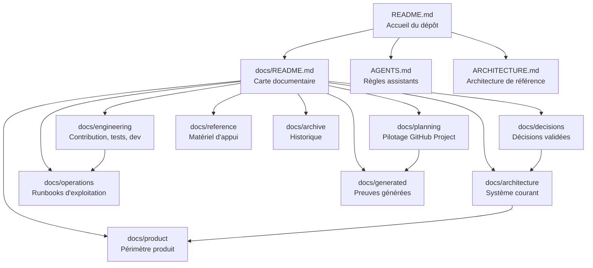

# Carte de documentation

Ce document est l'index de référence de la documentation KRAAK. Il indique où
chercher l'information courante, ce qui sert seulement d'appui, et ce qui est
conservé comme archive.

## Hiérarchie des sources



## Règle de précédence

```text
Accepted ADR > active architecture doc > active runbook/spec >
reference material > historical archive
```

Quand deux documents semblent se contredire, appliquer la règle ci-dessus puis
mettre à jour le document obsolète dans le même changement.

## Statuts documentaires

| Statut       | Sens                                            | Métadonnées             |
| ------------ | ----------------------------------------------- | ----------------------- |
| `active`     | Source de vérité courante                       | YAML obligatoire        |
| `reference`  | Support utile, non autoritaire                  | YAML obligatoire        |
| `historical` | Trace conservée d'un état passé                 | Notice d'archive        |
| `generated`  | Produit par automatisation, non édité à la main | Pas de YAML obligatoire |

Les preuves brutes et snapshots générés restent légers : ils sont classés par
leur dossier et par cet index, sans métadonnées lourdes dans chaque fichier.

## Cartographie active

| Domaine       | Source principale                                                              | Rôle                              |
| ------------- | ------------------------------------------------------------------------------ | --------------------------------- |
| Onboarding    | [`../README.md`](../README.md)                                                 | Démarrage rapide du dépôt         |
| Architecture  | [`../ARCHITECTURE.md`](../ARCHITECTURE.md), [`architecture/`](architecture/)   | Système courant                   |
| Décisions     | [`decisions/`](decisions/)                                                     | Raisons et arbitrages             |
| Produit       | [`product/MVP_SCOPE.md`](product/MVP_SCOPE.md)                                 | Périmètre construit               |
| Contribution  | [`engineering/CONTRIBUTION_WORKFLOW.md`](engineering/CONTRIBUTION_WORKFLOW.md) | Workflow Git et qualité           |
| Développement | [`engineering/LOCAL_DEVELOPMENT.md`](engineering/LOCAL_DEVELOPMENT.md)         | Lancement local                   |
| Tests         | [`engineering/TESTING.md`](engineering/TESTING.md)                             | Couverture et validation          |
| Exploitation  | [`operations/`](operations/)                                                   | Environnements, release, incident |
| Planning      | [`planning/GITHUB_PROJECT.md`](planning/GITHUB_PROJECT.md)                     | Pilotage Project #6               |
| Référence     | [`reference/`](reference/)                                                     | Matériel utile non autoritaire    |
| Généré        | [`generated/README.md`](generated/README.md)                                   | Artefacts automatisés             |
| Archive       | [`archive/README.md`](archive/README.md)                                       | Historique uniquement             |

## Arborescence attendue

```text
docs/
├── README.md
├── architecture/
├── decisions/
├── product/
├── engineering/
├── operations/
├── planning/
├── reference/
├── generated/
└── archive/
```

Les anciens dossiers `docs/context`, `docs/runbooks` et `docs/specs` ne sont plus
des points d'entrée actifs.
