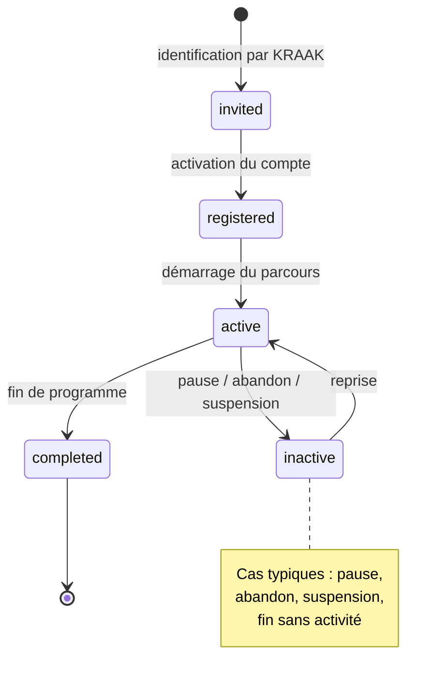
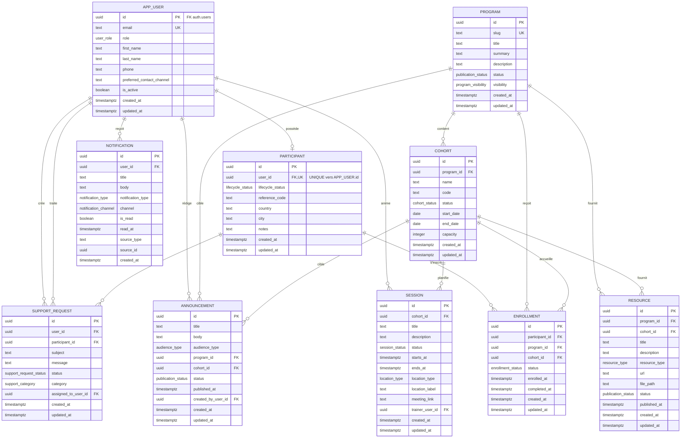

# Modèle de données MVP

## Table des matières

- [Modèle de données MVP](#modele-de-donnees-mvp)
  - [Objectif](#objectif)
  - [1. Rôles Utilisateur](#1-roles-utilisateur)
    - [Rôles retenus](#roles-retenus)
    - [Définition des rôles](#definition-des-roles)
      - [participant](#participant)
      - [admin](#admin)
      - [trainer (optionnel)](#trainer-optionnel)
  - [2. Cycle De Vie Participant](#2-cycle-de-vie-participant)
    - [Statuts retenus](#statuts-retenus)
    - [Signification](#signification)
      - [invited](#invited)
      - [registered](#registered)
      - [active](#active)
      - [completed](#completed)
      - [inactive](#inactive)
    - [Transitions minimales autorisées](#transitions-minimales-autorisees)
  - [3. Entités Métier Coeur](#3-entites-metier-coeur)
  - [4. Relations Entre Entités](#4-relations-entre-entites)
    - [Diagramme ER autoritaire](#diagramme-er-autoritaire)
    - [Règles métier minimales](#regles-metier-minimales)
  - [5. Règles De Visibilité](#5-regles-de-visibilite)
    - [Visibilité participant](#visibilite-participant)
    - [Visibilité admin](#visibilite-admin)
    - [Visibilité trainer](#visibilite-trainer)
  - [6. Données Éditables Par Participant Vs Admin](#6-donnees-editables-par-participant-vs-admin)
    - [Modifiables par participant](#modifiables-par-participant)
    - [Modifiables par admin](#modifiables-par-admin)
    - [Modifiables par trainer si rôle activé](#modifiables-par-trainer-si-role-active)
  - [7. Champs Minimums Par Entité](#7-champs-minimums-par-entite)
    - [User](#user)
    - [Participant](#participant-1)
    - [Program](#program)
    - [Cohort](#cohort)
    - [Session](#session)
    - [Resource](#resource)
    - [Announcement](#announcement)
    - [Enrollment](#enrollment)
    - [Notification](#notification)
    - [SupportRequest](#supportrequest)
  - [8. Décisions Simples De Modélisation À Garder](#8-decisions-simples-de-modelisation-a-garder)
  - [9. Prochaine Utilisation De Cette Spec](#9-prochaine-utilisation-de-cette-spec)

## Objectif

Ce document définit le modèle produit minimum de l'application KRAAK pour
servir de base commune au produit, au backend/API, au mobile, aux contrats de
données et au futur schéma de stockage.

Il consolide l'ancien modèle produit et l'ancien ERD MVP. Le diagramme ER
autoritaire est intégré dans ce document pour éviter plusieurs artefacts Mermaid
divergents.

Il couvre :

- les rôles utilisateur
- le cycle de vie participant
- les entités métier coeur
- les relations entre entités
- les règles de visibilité
- les droits d'édition participant vs admin
- les champs minimums par entité

---

## 1. Rôles Utilisateur

### Rôles retenus

- `participant`
- `admin`
- `trainer` uniquement si le besoin d'animation de sessions ou de gestion de
  contenu pédagogique ne peut pas être absorbé par `admin`

### Définition des rôles

#### `participant`

Utilisateur final inscrit ou en cours de parcours dans un programme KRAAK.

Usage principal :

- consulter ses programmes
- voir ses cohortes et sessions
- accéder aux ressources et annonces visibles
- recevoir des notifications
- envoyer des demandes de support
- mettre à jour certaines données personnelles autorisées

#### `admin`

Rôle de pilotage opérationnel et métier.

Usage principal :

- créer et gérer programmes, cohortes, sessions, ressources, annonces
- inviter des participants
- gérer les inscriptions et statuts
- voir l'ensemble des données métier
- traiter le support et les notifications

#### `trainer` (optionnel)

Rôle dédié à l'animation ou à l'encadrement pédagogique, à utiliser seulement si
le besoin est distinct du rôle admin.

Usage principal :

- voir les cohortes/sessions auxquelles il est rattaché
- publier ou gérer certains contenus pédagogiques si autorisé
- consulter les participants liés à ses sessions/cohortes selon le périmètre
  accordé

Décision produit :

- par défaut MVP, `trainer` est **optionnel**
- si non activé, ses capacités sont absorbées par `admin`

---

## 2. Cycle De Vie Participant

### Statuts retenus

- `invited`
- `registered`
- `active`
- `completed`
- `inactive`

### Signification

#### `invited`

Participant identifié par KRAAK et invité à rejoindre la plateforme, mais pas
encore pleinement onboardé.

#### `registered`

Participant ayant créé ou activé son accès, mais dont le parcours n'a pas encore
réellement démarré.

#### `active`

Participant en parcours actif, rattaché à au moins une inscription exploitable.

#### `completed`

Participant ayant terminé le programme ou la cohorte concernée.

#### `inactive`

Participant non actuellement actif pour des raisons métier ou opérationnelles.

Cas typiques :

- pause
- abandon
- suspension d'accès
- fin de parcours sans activité en cours

### Transitions minimales autorisées

- `invited` -> `registered`
- `registered` -> `active`
- `active` -> `completed`
- `active` -> `inactive`
- `inactive` -> `active`

Règle :

- le statut de cycle de vie participant est piloté par l'équipe KRAAK ; il n'est
  pas modifiable librement par le participant lui-même

---

## 3. Entités Métier Coeur

Entités retenues :

- `User`
- `Participant`
- `Program`
- `Cohort`
- `Session`
- `Resource`
- `Announcement`
- `Enrollment`
- `Notification`
- `SupportRequest`

---

## 4. Relations Entre Entités

### Diagramme ER autoritaire

### Règles métier minimales

- un participant ne doit voir que les cohortes, sessions, ressources,
  annonces et notifications qui découlent de ses inscriptions valides
- une cohorte ne peut pas exister sans programme parent
- une session ne peut pas exister sans cohorte parente
- une inscription est la source d'autorité pour savoir si un participant a accès
  à un programme/cohorte

---

## 5. Règles De Visibilité

### Visibilité `participant`

Peut voir :

- son propre `User`
- son propre `Participant`
- ses `Enrollment`
- les `Program` liés à ses inscriptions
- les `Cohort` liées à ses inscriptions
- les `Session` des cohortes visibles
- les `Resource` publiées pour ses cohortes/programmes visibles
- les `Announcement` adressées à ses cohortes/programmes ou à tous les
  participants autorisés
- ses `Notification`
- ses `SupportRequest`

Ne peut pas voir :

- les données internes admin
- les données d'autres participants
- les cohortes/programmes non liés à ses inscriptions, sauf décision produit
  explicite
- les demandes de support d'autres utilisateurs

### Visibilité `admin`

Peut voir :

- toutes les entités métier
- toutes les inscriptions, cohortes, sessions, annonces, notifications et
  demandes de support

### Visibilité `trainer`

Peut voir, si ce rôle est activé :

- ses sessions assignées
- les cohortes associées à ses sessions ou affectations
- les participants rattachés à ce périmètre, dans la limite utile à l'animation
- les ressources et annonces pertinentes à son périmètre

Ne peut pas voir par défaut :

- l'intégralité des données admin globales
- les participants ou cohortes hors de son périmètre métier

---

## 6. Données Éditables Par Participant Vs Admin

### Modifiables par `participant`

- champs de profil personnel autorisés dans `User` / `Participant`
- préférences de notification simples
- contenu de ses `SupportRequest`

Ne peut pas modifier :

- son rôle
- son lifecycle participant
- ses inscriptions
- les programmes, cohortes, sessions, ressources, annonces

### Modifiables par `admin`

- toutes les entités coeur
- les statuts et rattachements
- la visibilité et la publication des contenus
- les inscriptions et assignations
- le traitement du support

### Modifiables par `trainer` si rôle activé

- éventuellement le contenu ou statut de certaines sessions
- éventuellement certaines ressources ou annonces de son périmètre
- jamais les rôles globaux, les inscriptions globales, ni l'administration
  complète des participants hors périmètre

---

## 7. Champs Minimums Par Entité

### `User`

Champs minimums :

- `id`
- `email`
- `role` (`participant` | `admin` | `trainer`)
- `firstName`
- `lastName`
- `phone` (optionnel au minimum produit, mais prévu)
- `preferredContactChannel` (optionnel)
- `isActive`
- `createdAt`
- `updatedAt`

Rôle :

- identité applicative et accès

### `Participant`

Champs minimums :

- `id`
- `userId`
- `lifecycleStatus` (`invited` | `registered` | `active` | `completed` |
  `inactive`)
- `referenceCode` (optionnel mais recommandé)
- `country` (optionnel)
- `city` (optionnel)
- `notes` (admin only, optionnel)
- `createdAt`
- `updatedAt`

Rôle :

- profil métier du participant distinct du compte d'accès

### `Program`

Champs minimums :

- `id`
- `slug`
- `title`
- `summary`
- `description`
- `status` (`draft` | `published` | `archived`)
- `visibility` (`private` | `participants` | `public` si besoin futur)
- `createdAt`
- `updatedAt`

Rôle :

- offre ou parcours structurant

### `Cohort`

Champs minimums :

- `id`
- `programId`
- `name`
- `code` (optionnel mais recommandé)
- `status` (`draft` | `open` | `active` | `completed` | `archived`)
- `startDate`
- `endDate` (optionnel)
- `capacity` (optionnel)
- `createdAt`
- `updatedAt`

Rôle :

- instance d'exécution d'un programme

### `Session`

Champs minimums :

- `id`
- `cohortId`
- `title`
- `description`
- `status` (`scheduled` | `live` | `completed` | `cancelled`)
- `startsAt`
- `endsAt`
- `locationType` (`online` | `onsite` | `hybrid`)
- `locationLabel` ou `meetingLink`
- `trainerUserId` (optionnel)
- `createdAt`
- `updatedAt`

Rôle :

- séance datée rattachée à une cohorte

### `Resource`

Champs minimums :

- `id`
- `programId` ou `cohortId`
- `title`
- `description` (optionnel)
- `resourceType` (`link` | `file` | `video` | `document`)
- `resourceTheme` (`training` | `project_management` | `immigration` | `career`)
- `resourceAudience` (`all` | `young_professionals_students` | `organizations` | `international_candidates`)
- `url` ou `filePath`
- `status` (`draft` | `published` | `archived`)
- `publishedAt` (optionnel)
- `createdAt`
- `updatedAt`

Rôle :

- support pédagogique ou informationnel

### `Announcement`

Champs minimums :

- `id`
- `title`
- `body`
- `priority` (`low` | `normal` | `high` | `critical`)
- `audienceType` (`all_participants` | `program` | `cohort` | `custom`)
- `programId` (optionnel)
- `cohortId` (optionnel)
- `status` (`draft` | `published` | `archived`)
- `publishedAt`
- `createdByUserId`
- `createdAt`
- `updatedAt`

Rôle :

- communication descendante visible dans l'app

Règles de publication MVP :

- `all_participants`: `programId = null` et `cohortId = null`
- `program`: `programId` requis et `cohortId = null`
- `cohort`: `programId` et `cohortId` requis
- `custom`: réservé V1.1+ (non utilisé pour le format MVP)
- `draft`: `publishedAt = null`
- `published`/`archived`: `publishedAt` requis

### `Enrollment`

Champs minimums :

- `id`
- `participantId`
- `programId`
- `cohortId` (optionnel selon moment d'affectation)
- `status` (`pending` | `active` | `completed` | `cancelled`)
- `enrolledAt`
- `completedAt` (optionnel)
- `progressCompletedSessionIds` (liste, peut être vide, des sessions marquées terminées)
- `progressUpdatedAt` (horodatage de la dernière mise à jour progression, optionnel)
- `createdAt`
- `updatedAt`

Rôle :

- rattachement métier d'un participant à un programme et/ou une cohorte

### `Notification`

Champs minimums :

- `id`
- `userId`
- `title`
- `body`
- `notificationType` (`announcement` | `session-reminder` | `system` |
  `support-update`)
- `channel` (`in_app` | `push`)
- `isRead`
- `readAt` (optionnel)
- `sourceType` (optionnel)
- `sourceId` (optionnel)
- `createdAt`

Rôle :

- trace d'information adressée à un utilisateur

### `SupportRequest`

Champs minimums :

- `id`
- `userId`
- `participantId` (optionnel si demande non participant)
- `subject`
- `message`
- `status` (`open` | `in_progress` | `resolved` | `closed`)
- `category` (`technical` | `program` | `session` | `billing` | `other`)
- `assignedToUserId` (optionnel)
- `createdAt`
- `updatedAt`

Rôle :

- demande d'assistance ou de support opérationnel

---

## 8. Décisions Simples De Modélisation À Garder

- séparer `User` et `Participant`
- faire de `Enrollment` l'entité d'autorité pour l'accès métier
- rattacher `Session` à `Cohort`, pas directement au participant
- traiter `Notification` comme entité utilisateur finale, même si elle provient
  d'une annonce ou d'un événement système
- garder `trainer` optionnel tant que le besoin n'est pas confirmé

---

## 9. Prochaine Utilisation De Cette Spec

Cette spec doit servir ensuite à :

- définir les contrats TypeScript partagés
- préparer le schéma de données Supabase/Postgres
- cadrer les endpoints NestJS
- cadrer les écrans mobile et les règles d'autorisation
