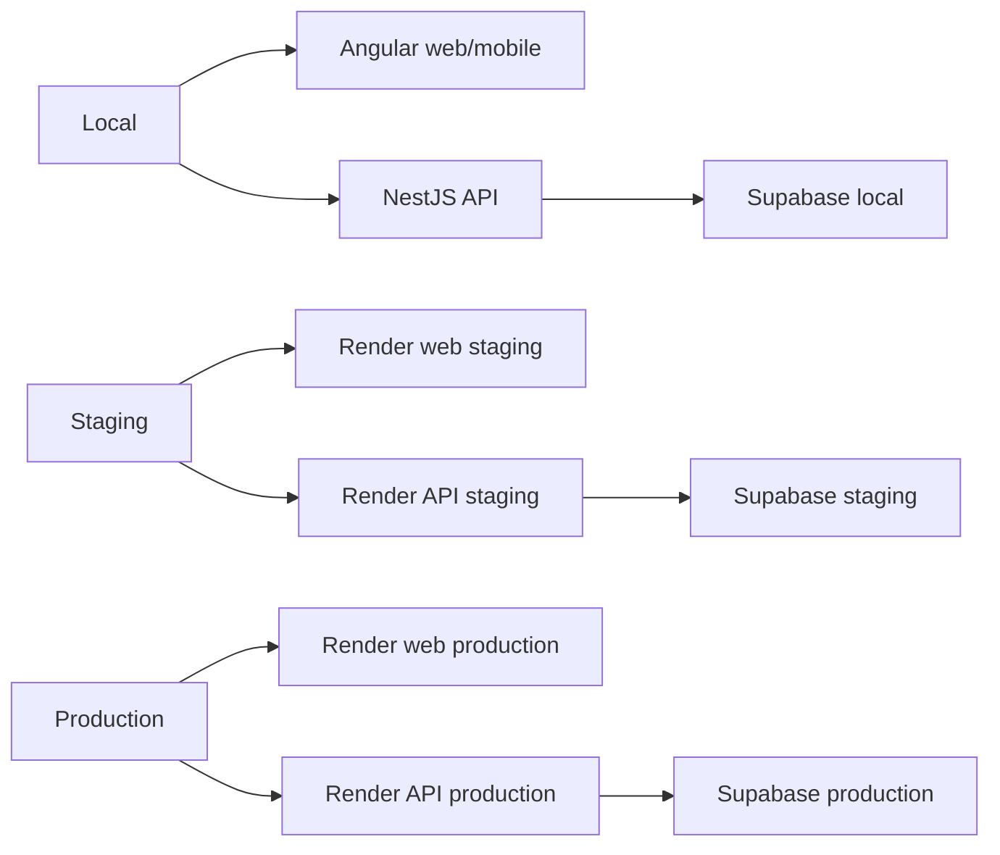

# Architecture de déploiement

## Table des matières

- [Architecture de déploiement](#architecture-de-deploiement)
  - [Topologie courante](#topologie-courante)
  - [Branches et déclencheurs](#branches-et-declencheurs)
  - [Internationalisation cible du web statique](#internationalisation-cible-du-web-statique)
  - [Sources liées](#sources-liees)

KRAAK utilise Render pour le web et l'API, avec Supabase par environnement.

## Topologie courante

| Surface           | Staging             | Production          |
| ----------------- | ------------------- | ------------------- |
| Web               | `kraak-web-staging` | `kraak-web-prod`    |
| API               | `kraak-api-staging` | `kraak-api-prod`    |
| Base/Auth/Storage | Supabase staging    | Supabase production |

## Branches et déclencheurs

- `staging` est la branche d'intégration et déclenche la validation staging.
- `main` est la branche de release.
- La production est déclenchée par tag SemVer sur `main`.
- Les secrets et variables d'environnement restent hors dépôt.

## Internationalisation cible du web statique

Le modèle cible d'internationalisation gardera un service Render static par
environnement. Le build web pourra plus tard publier un seul dossier `public`
contenant des sous-arbres localisés, par exemple `public/fr/` et `public/en/`,
ainsi que les assets partagés, `sitemap.xml`, `robots.txt` et `404.html`.

La configuration Render restera la source de vérité opérationnelle au moment où
ce modèle sera implémenté. Cette PR ne modifie ni `render.yaml`, ni les commandes
de build, ni les variables d'environnement.

## Sources liées

- [`../operations/DEPLOYMENT.md`](../operations/DEPLOYMENT.md) pour la procédure
  Render courante.
- [`../operations/STAGING_VALIDATION.md`](../operations/STAGING_VALIDATION.md)
  pour la validation staging.
- [`../operations/RELEASE_PROD.md`](../operations/RELEASE_PROD.md) pour la
  release production.
- [`../operations/ENVIRONMENTS.md`](../operations/ENVIRONMENTS.md) pour les
  variables d'environnement.
- [`../decisions/ARC-19-i18n-localization-strategy.md`](../decisions/ARC-19-i18n-localization-strategy.md)
  pour le modèle cible d'internationalisation.
