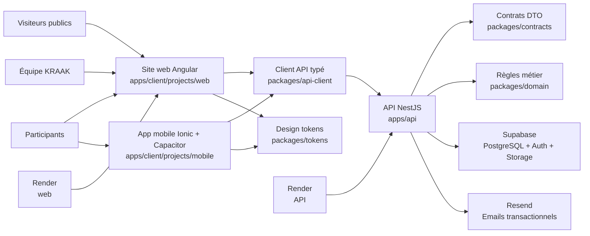

# Vue d'ensemble de la stack technique

## Table des matières

- [Vue d'ensemble de la stack technique](#vue-densemble-de-la-stack-technique)
  - [Vue d'ensemble](#vue-densemble)
  - [Frontend](#frontend)
    - [Angular (v21)](#angular-v21)
    - [PrimeNG (v21)](#primeng-v21)
    - [Tailwind CSS (v4)](#tailwind-css-v4)
    - [Ionic + Capacitor (mobile)](#ionic-capacitor-mobile)
  - [Backend](#backend)
    - [NestJS (v11)](#nestjs-v11)
  - [Base de données et services](#base-de-donnees-et-services)
    - [Supabase](#supabase)
  - [Outils de développement](#outils-de-developpement)
    - [pnpm](#pnpm)
    - [TypeScript](#typescript)
    - [Prettier et ESLint](#prettier-et-eslint)
  - [Déploiement](#deploiement)
  - [Règle documentaire](#regle-documentaire)
  - [Pour aller plus loin](#pour-aller-plus-loin)

Ce document explique les technologies utilisées dans le projet KRAAK, à destination des personnes qui les découvrent.

---

## Vue d'ensemble



Le web et le mobile restent des surfaces clientes. L'API porte l'orchestration
serveur, les packages partagés stabilisent les contrats et règles transverses,
et les services externes restent isolés derrière l'API.

---

## Frontend

### Angular (v21)

**Ce que c'est :** Un framework JavaScript/TypeScript pour construire des interfaces web. C'est une alternative à React ou Vue.js.

**Pourquoi Angular :** Il fournit une structure complète (routing, formulaires, HTTP, tests) dans un seul package. Adapté pour une équipe qui veut des conventions claires.

**Concepts clés à connaître :**

| Concept       | Explication rapide                                                                         |
| ------------- | ------------------------------------------------------------------------------------------ |
| **Component** | Un bloc d'interface (HTML + CSS + TypeScript). Chaque page ou élément UI est un composant. |
| **Module**    | Un regroupement de composants et services.                                                 |
| **Service**   | Une classe qui gère la logique métier ou les appels API.                                   |
| **Route**     | Une URL associée à un composant (`/accueil` → `HomeComponent`).                            |
| **Template**  | Le HTML d'un composant, avec la syntaxe Angular (`@if`, `@for`, etc.).                     |

**Fichiers importants :**

- `apps/client/projects/web/src/app/` — Code source du site web
- `apps/client/projects/mobile/src/app/` — Code source de l'app mobile
- `apps/client/angular.json` — Configuration des projets Angular
- `packages/tokens/` — Tokens de design partagés déjà actifs dans le repo

### PrimeNG (v21)

**Ce que c'est :** Une bibliothèque de composants UI prêts à l'emploi pour Angular (boutons, tableaux, formulaires, dialogues…).

**Pourquoi PrimeNG :** Évite de recréer des composants UI de zéro. Fournit des composants accessibles et personnalisables.

### Tailwind CSS (v4)

**Ce que c'est :** Un framework CSS « utilitaire ». Au lieu d'écrire du CSS dans des fichiers séparés, on applique des classes directement dans le HTML.

**Exemple :**

```html
<!-- Sans Tailwind -->
<div style="padding: 16px; background: white; border-radius: 8px;">
  <!-- Avec Tailwind -->
  <div class="rounded-lg bg-white p-4"></div>
</div>
```

### Ionic + Capacitor (mobile)

**Ce que c'est :** Ionic fournit des composants UI optimisés pour mobile. Capacitor permet de compiler l'app Angular en application native iOS/Android.

**En développement :** On travaille dans un navigateur web, comme pour le site. Capacitor entre en jeu uniquement pour builder une version native.

---

## Backend

### NestJS (v11)

**Ce que c'est :** Un framework backend TypeScript inspiré d'Angular. Il structure le code serveur avec des modules, contrôleurs et services.

**Pourquoi NestJS :** Structure claire, TypeScript natif, bien adapté pour une API REST.

**Concepts clés :**

| Concept        | Explication rapide                                                                        |
| -------------- | ----------------------------------------------------------------------------------------- |
| **Controller** | Reçoit les requêtes HTTP (`GET /health`, `POST /support/contact`, alias `POST /contact`). |
| **Service**    | Contient la logique métier (envoyer un email, lire la BDD).                               |
| **Module**     | Regroupe les contrôleurs et services liés.                                                |
| **DTO**        | (Data Transfer Object) Définit la structure des données reçues/envoyées.                  |
| **Guard**      | Vérifie l'autorisation avant d'accéder à une route.                                       |

**Fichiers importants :**

- `apps/api/src/main.ts` — Point d'entrée du serveur
- `apps/api/src/app.module.ts` — Module racine
- `apps/api/src/app.controller.ts` — Contrôleur principal
- `apps/api/src/support/` — Module support/contact MVP

---

## Base de données et services

### Supabase

**Ce que c'est :** Une plateforme qui fournit une base de données PostgreSQL, un système d'authentification, et du stockage de fichiers — le tout accessible via une API.

**Pourquoi Supabase :** Évite de configurer manuellement PostgreSQL, un système d'auth, et un serveur de fichiers. Fournit une interface web pour gérer les données.

**Composants Supabase utilisés :**

| Composant    | Usage dans KRAAK                             |
| ------------ | -------------------------------------------- |
| **Database** | Base PostgreSQL pour stocker les données     |
| **Auth**     | Inscription, connexion, gestion des sessions |
| **Storage**  | Stockage de fichiers (images, documents)     |

**Accès depuis le code :** L'intégration Supabase reste une cible d'architecture.
À ce stade, le repo contient surtout la structure NestJS et les répertoires
fonctionnels, sans service Supabase branché dans `apps/api/src/`.

---

## Outils de développement

### pnpm

**Ce que c'est :** Un gestionnaire de packages (comme `npm` ou `yarn`), mais plus rapide et efficace grâce à un cache partagé.

**Commandes essentielles :**

```bash
pnpm install          # Installer toutes les dépendances
pnpm add <package>    # Ajouter un package
pnpm remove <package> # Supprimer un package
pnpm run <script>     # Exécuter un script du package.json
```

### TypeScript

**Ce que c'est :** Un sur-ensemble de JavaScript qui ajoute le typage statique. Tout le code du projet est en TypeScript (`.ts`).

**Avantage principal :** Les erreurs de type sont détectées avant l'exécution, pas pendant.

### Prettier et ESLint

- **Prettier** : formatage automatique du code (indentation, guillemets, etc.)
- **ESLint** : détection de problèmes de qualité (variables inutilisées, imports manquants, etc.)

---

## Déploiement

| Application | Plateforme | Comment                                             |
| ----------- | ---------- | --------------------------------------------------- |
| Site web    | **Render** | Plateforme cible configurée via `render.yaml`       |
| API         | **Render** | Déploiement via Docker (voir `apps/api/Dockerfile`) |

---

## Règle documentaire

Quand un changement de code modifie la structure du repo, les commandes, les
intégrations ou les chemins listés ici, ce document doit être mis à jour dans
le même changement.

---

## Pour aller plus loin

Pour une liste plus exhaustive des technologies déclarées dans le dépôt et de
leurs URLs officielles, voir
[`OFFICIAL_SOURCES.md`](../reference/OFFICIAL_SOURCES.md).

| Ressource                  | Lien                                                            |
| -------------------------- | --------------------------------------------------------------- |
| Documentation Angular      | [angular.dev](https://angular.dev/)                             |
| Documentation NestJS       | [docs.nestjs.com](https://docs.nestjs.com/)                     |
| Documentation Supabase     | [supabase.com/docs](https://supabase.com/docs)                  |
| Documentation PrimeNG      | [primeng.org](https://primeng.org/)                             |
| Documentation Tailwind CSS | [tailwindcss.com/docs](https://tailwindcss.com/docs)            |
| Documentation Ionic        | [ionicframework.com/docs](https://ionicframework.com/docs)      |
| Documentation pnpm         | [pnpm.io](https://pnpm.io/)                                     |
| Conventional Commits       | [conventionalcommits.org](https://www.conventionalcommits.org/) |
