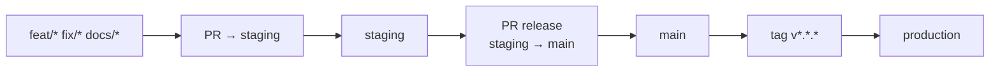

> **Status:** Historical.
> This document does not define the current process.
> Active reference: [CONTRIBUTION_WORKFLOW](../../engineering/CONTRIBUTION_WORKFLOW.md)

# GIT_WORKFLOW_CHEATSHEET — Workflow Git courant

## Table des matières

- [GITWORKFLOWCHEATSHEET — Workflow Git courant](#gitworkflowcheatsheet-workflow-git-courant)
  - [🚀 Première fois (Setup)](#-premiere-fois-setup)
  - [Règle centrale](#regle-centrale)
  - [Démarrer une tâche](#demarrer-une-tache)
  - [Rebaser avant push](#rebaser-avant-push)
  - [Ouvrir la PR](#ouvrir-la-pr)
  - [Après merge](#apres-merge)
  - [Release production](#release-production)

> Commandes et étapes rapides pour développer dans KRAAK.

## 🚀 Première fois (Setup)

```bash
# Cloner
git clone https://github.com/Ange230700/kraak-consulting.git
cd kraak-consulting

# Configurer git (rebase-only + fast-forward)
# Sur macOS/Linux:
./scripts/setup-git-config.sh

# Sur Windows PowerShell:
.\scripts\setup-git-config.ps1

# Installer dépendances
pnpm install
```

## Règle centrale

`staging` est la branche d'intégration. `main` est la branche de release.



## Démarrer une tâche

```bash
git switch staging
git pull --rebase origin staging
git switch -c feat/nom-court
```

## Rebaser avant push

```bash
git fetch origin
git rebase origin/staging
```

## Ouvrir la PR

```bash
git push -u origin HEAD
gh pr create --base staging --head "$(git branch --show-current)"
```

## Après merge

```bash
git switch staging
git pull --rebase origin staging
git branch -d feat/nom-court
git push origin --delete feat/nom-court
```

## Release production

```bash
git switch staging
git pull --rebase origin staging

gh pr create \
  --base main \
  --head staging \
  --title "release: promote staging to main"
```

Après merge sur `main`, créer le tag SemVer depuis `main`.
