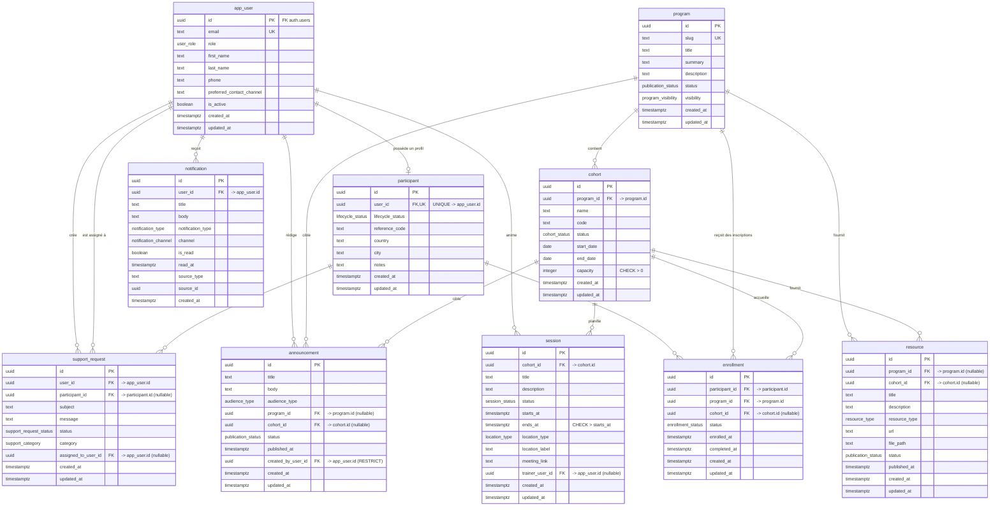

> **Status:** Historical.
> This document does not define the current process.
> Active reference: [DATA_MODEL](../../architecture/DATA_MODEL.md)

# ERD MVP KRAAK

## Description

Ce document explique le diagramme entité-relation complet du MVP KRAAK.

Il complète :

- [`docs/decisions/ARC-04-modeles-donnees-mvp.md`](../../decisions/ARC-04-modeles-donnees-mvp.md) pour la décision d'architecture
- [`docs/architecture/DATA_MODEL.md`](../../architecture/DATA_MODEL.md) pour la vision produit

Le périmètre reste strictement celui du MVP. Les éléments de V1.1+ comme les
paiements, le LMS complet, les certificats, le CRM avancé ou les automatisations
marketing n'en font pas partie.

Les domaines couverts par l'ERD sont :

- l'identité utilisateur
- le profil participant
- les programmes, cohortes et sessions
- les ressources et annonces
- les inscriptions
- les notifications
- les demandes de support

---

## Explication

### Vue d'ensemble

Le modèle s'organise autour de quatre blocs métier :

1. `app_user` et `participant` pour l'identité et le profil métier
2. `program`, `cohort` et `session` pour l'offre de formation
3. `resource` et `announcement` pour les contenus et communications
4. `enrollment`, `notification` et `support_request` pour les opérations
   visibles par l'utilisateur

### Comment lire les cardinalités

Dans le diagramme Mermaid :

- `||` signifie "exactement un"
- `o|` signifie "zéro ou un"
- `o{` signifie "zéro ou plusieurs"

Exemple :

- `app_user ||--o| participant` signifie qu'un utilisateur peut avoir zéro ou
  un profil participant
- `program ||--o{ cohort` signifie qu'un programme peut contenir plusieurs
  cohortes

### Rôle de chaque entité

| Entité            | Rôle                                            | Relations principales                                                                                    |
| ----------------- | ----------------------------------------------- | -------------------------------------------------------------------------------------------------------- |
| `app_user`        | Point d'entrée identitaire lié à `auth.users`   | reçoit des notifications, crée des demandes de support, peut rédiger des annonces et animer des sessions |
| `participant`     | Profil métier enrichi d'un utilisateur          | s'inscrit à des programmes et peut ouvrir des demandes de support                                        |
| `program`         | Offre de formation ou d'accompagnement          | contient des cohortes, porte des ressources, annonces et inscriptions                                    |
| `cohort`          | Instance planifiée d'un programme               | contient des sessions et peut cibler ressources, annonces et inscriptions                                |
| `session`         | Rendez-vous ou temps de formation d'une cohorte | appartient à une cohorte et peut être animé par un `app_user`                                            |
| `resource`        | Contenu pédagogique ou informatif               | est rattachée à un programme, à une cohorte, ou aux deux selon le besoin                                 |
| `announcement`    | Communication ciblée                            | peut viser tout le monde, un programme ou une cohorte                                                    |
| `enrollment`      | Source d'autorité de l'accès participant        | relie un `participant` à un `program` et éventuellement à une `cohort`                                   |
| `notification`    | Message adressé à un utilisateur                | appartient à un `app_user` et peut référencer une source métier                                          |
| `support_request` | Ticket de support ou demande d'aide             | est créé par un utilisateur et peut être assigné à un autre utilisateur                                  |

### Logique métier principale

`app_user` est la racine identitaire côté application. Le compte est adossé à
`auth.users`, puis enrichi dans `app_user` avec le rôle et les informations
métiers utiles au MVP.

`participant` n'est pas une table d'authentification. C'est un profil métier
optionnel rattaché en `1:1` à `app_user`. Cela permet de garder la distinction
entre identité technique et parcours participant.

`program`, `cohort` et `session` forment l'ossature de l'offre. Un programme
décrit l'offre, une cohorte la décline dans le temps, et une session représente
un moment concret du parcours.

`enrollment` est la relation la plus importante pour les droits d'accès métier.
Elle détermine qu'un participant est effectivement rattaché à un programme et,
si besoin, à une cohorte précise.

`resource` et `announcement` utilisent des clés étrangères nullables pour
supporter plusieurs niveaux de ciblage MVP :

- niveau programme
- niveau cohorte
- parfois programme + cohorte, quand le contenu ou le message doit rester
  contextualisé

`notification` et `support_request` couvrent la communication opérationnelle.
La première pousse une information vers l'utilisateur ; la seconde remonte une
demande vers l'équipe KRAAK.

### Contraintes à retenir

- `participant.user_id` est unique : un utilisateur ne porte qu'un seul profil
  participant
- `cohort.program_id` est obligatoire : une cohorte n'existe jamais seule
- `session.cohort_id` est obligatoire : une session dépend toujours d'une
  cohorte
- `enrollment` porte la relation de référence entre participant et programme
- `resource` et `announcement` s'appuient sur des règles métier de ciblage,
  pas sur une table de jointure générique

---

## Exemple

Exemple de parcours simple dans le modèle :

1. KRAAK crée un compte `app_user` pour Aïcha et le lie à `auth.users`.
2. Aïcha reçoit un profil `participant` avec un `reference_code` et son statut
   de cycle de vie.
3. L'équipe publie un `program` nommé "Leadership de service".
4. Une `cohort` "LS-2026-01" est créée pour ce programme.
5. Deux `session` sont planifiées dans cette cohorte, dont une animée par un
   formateur rattaché à `app_user`.
6. Une ligne `enrollment` rattache Aïcha au programme et à la cohorte.
7. Une `resource` propre à la cohorte est publiée pour préparer la première
   session.
8. Une `announcement` ciblée cohorte informe les participants d'un changement
   d'horaire.
9. Aïcha reçoit une `notification`.
10. Si elle a une question, elle crée une `support_request` qui peut ensuite
    être assignée à un membre de l'équipe.

Cet exemple montre que l'accès utile du participant ne dépend pas d'un lien
direct entre toutes les tables, mais du chaînage :

`app_user` -> `participant` -> `enrollment` -> `program` / `cohort` -> `session` / `resource` / `announcement`

---

## Diagramme Mermaid

Le bloc ci-dessous reprend le diagramme de référence actuellement conservé dans
[`docs/reference/diagrams/erd-full.mmd`](../../reference/diagrams/erd-full.mmd).

