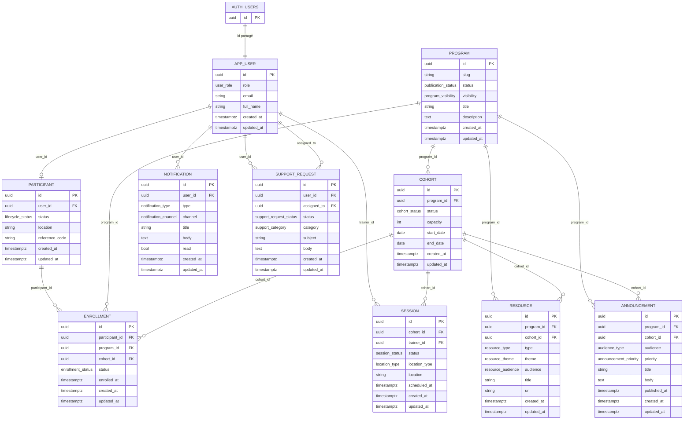

# ARC-04 — Modèles de données MVP

| Champ          | Valeur       |
| -------------- | ------------ |
| **Statut**     | Acceptée     |
| **Date**       | 2025-07-18   |
| **Auteurs**    | Équipe KRAAK |
| **Dépendance** | ARC-01       |
| **Liée à**     | ARC-05       |

---

## 1 · Contexte

Le MVP KRAAK doit stocker et gérer les données de plusieurs domaines métier :
utilisateurs, participants, programmes de formation, cohortes, sessions,
ressources, annonces, inscriptions, notifications et demandes de support.

Le choix de Supabase (ARC-01) impose PostgreSQL comme moteur de base de données,
avec Row Level Security (RLS) comme mécanisme principal de contrôle d'accès.

Les contraintes sont :

- schéma suffisant pour le MVP sans sur-ingénierie ;
- sécurité au niveau ligne (RLS) dès le départ ;
- pas d'ORM (décision ARC-01) — requêtes via le client Supabase JS ;
- migrations versionnées et reproductibles.

---

## 2 · Décision

Adopter un schéma initial de **10 tables** avec **18 types enum** PostgreSQL,
des politiques RLS par table, des index ciblés, et des triggers `updated_at`
automatiques.

### 2.1 Entités

| Table             | Rôle                                                                                 |
| ----------------- | ------------------------------------------------------------------------------------ |
| `app_user`        | Utilisateur lié à `auth.users` Supabase (rôles : admin, staff, trainer, participant) |
| `participant`     | Profil participant enrichi (statut cycle de vie, localisation, code de référence)    |
| `program`         | Programme de formation (slug, statut publication, visibilité, description)           |
| `cohort`          | Cohorte rattachée à un programme (dates, capacité, statut)                           |
| `session`         | Session de formation dans une cohorte (date, lieu, formateur)                        |
| `resource`        | Ressource pédagogique rattachée à un programme ou une cohorte                        |
| `announcement`    | Annonce ciblée (audience : tous, programme, cohorte)                                 |
| `enrollment`      | Inscription d'un participant à un programme et/ou une cohorte                        |
| `notification`    | Notification utilisateur (in-app, email, push)                                       |
| `support_request` | Demande de support (catégorie, statut, assignation)                                  |

### 2.2 Types enum

```sql
-- Rôles et statuts
user_role             -- admin, staff, trainer, participant
lifecycle_status      -- prospect, active, inactive, archived
publication_status    -- draft, published, archived
program_visibility    -- public, unlisted, private
cohort_status         -- planned, open, in_progress, completed, cancelled
session_status        -- scheduled, in_progress, completed, cancelled
enrollment_status     -- pending, active, paused, completed, cancelled, refunded

-- Types
location_type         -- online, onsite, hybrid
resource_type         -- link, file, video, document
resource_theme        -- training, project_management, immigration, career
resource_audience     -- all, young_professionals_students, organizations, international_candidates
audience_type         -- all_participants, program, cohort, custom (réservé V1.1+)
announcement_priority -- low, normal, high, critical
notification_type     -- system, enrollment, session, announcement, support
notification_channel  -- in_app, email, push
support_request_status -- open, in_progress, resolved, closed
support_category      -- technical, administrative, pedagogical, other
```

---

## 3 · Justification

### 3.1 Choix du nombre d'entités

Le schéma à 10 tables couvre les besoins MVP sans anticiper les fonctionnalités
V1.1+ (LMS complet, CRM, paiements). Chaque table correspond à un concept
métier identifiable et nécessaire au MVP.

### 3.2 Comparaison des approches

| Critère                      | Schéma dédié PostgreSQL | JSON/NoSQL      | ORM généré         |
| ---------------------------- | ----------------------- | --------------- | ------------------ |
| Intégrité référentielle      | ✅ FK natives           | ❌ Manuelle     | ✅ Via ORM         |
| Sécurité par ligne (RLS)     | ✅ Native Supabase      | ❌ Custom       | ⚠️ Partiel         |
| Performance requêtes ciblées | ✅ Index + enum         | ⚠️ Variable     | ✅ Bonne           |
| Flexibilité schéma           | ⚠️ Migrations requises  | ✅ Flexible     | ⚠️ Migrations      |
| Complexité opérationnelle    | ✅ Supabase gère        | ⚠️ Infra custom | ⚠️ ORM + migration |

### 3.3 Sécurité RLS

Chaque table active RLS avec au minimum :

- une politique **admin full access** (`is_admin()`) ;
- une politique **lecture propre** pour les utilisateurs authentifiés ;
- des politiques contextuelles (inscription, audience) pour les données partagées.

La fonction utilitaire `is_admin()` est définie en `SECURITY DEFINER` pour
vérifier le rôle sans exposer la table `app_user`.

---

## 4 · Implémentation

### 4.1 Migration initiale

Fichier : `supabase/migrations/20250718000000_initial_schema.sql`

Structure de la migration :

1. Extension `uuid-ossp`
2. 18 types enum
3. Fonction utilitaire `update_updated_at()`
4. 10 tables avec clés primaires UUID, foreign keys, contraintes CHECK
5. Index sur FK et colonnes de filtrage fréquentes
6. Triggers `updated_at` sur toutes les tables mutables
7. Activation RLS sur toutes les tables
8. Fonction `is_admin()` + politiques RLS par table

### 4.2 Conventions de nommage

- Tables : `snake_case` singulier (`app_user`, pas `app_users`)
- Colonnes : `snake_case`
- Enums : `snake_case` (type et valeurs)
- Index : `idx_<table>_<colonne(s)>`
- Triggers : `trg_<table>_updated_at`
- Politiques RLS : `<table>_<action>_<portée>` (ex : `program_select_published`)

### 4.3 Relations clés

```text
auth.users ← app_user (1:1, id partagé)
app_user ← participant (1:1, user_id FK)
program ← cohort (1:N, program_id FK)
cohort ← session (1:N, cohort_id FK)
program/cohort ← resource (polymorphe via CHECK)
program/cohort ← announcement (audience_type discriminateur + priority)
participant + program ← enrollment (N:N, contrainte UNIQUE)
app_user ← notification (1:N, user_id FK)
app_user ← support_request (1:N, user_id FK)
```

### 4.3bis Diagramme entité-relation (ERD)

Une version expliquée du diagramme complet est disponible dans
[`docs/architecture/DATA_MODEL.md`](../architecture/DATA_MODEL.md).



### 4.4 Contraintes notables

- `cohort.capacity` : `CHECK (capacity > 0)`
- `enrollment` : `UNIQUE (participant_id, program_id)` — un participant ne
  s'inscrit qu'une fois par programme
- `resource` : `CHECK` — au moins un parent (`program_id` ou `cohort_id`)
- `resource.resource_theme` : catégorisation métier pour filtrer les contenus
- `resource.resource_audience` : segment de public visé pour la ressource
- `announcement` : priorité explicite (`low|normal|high|critical`) et règles
  de publication MVP (all_participants sans parent, program avec `program_id`
  uniquement, cohort avec `program_id` + `cohort_id`)
- Toutes les colonnes `id` : UUID v4 générés par `uuid_generate_v4()`

---

## 5 · Alternatives considérées

1. **Schéma minimal (3-4 tables)** — Rejeté : insuffisant pour couvrir les
   parcours MVP (inscription, cohortes, notifications).
2. **Schéma étendu avec paiements et LMS** — Rejeté : sur-ingénierie, hors
   périmètre MVP. Ajout prévu en V1.1+.
3. **NoSQL (MongoDB / Firestore)** — Rejeté : perte des FK, RLS natif
   indisponible, moins adapté aux données relationnelles du domaine.
4. **ORM avec migrations générées (Prisma, TypeORM)** — Écarté conformément à
   ARC-01. Le client Supabase JS suffit pour le MVP.

---

## 6 · Limites et évolutions

- **Paiements** : pas de table `payment` ni `invoice` dans le MVP. À ajouter
  en V1.1+ si un tunnel de paiement est implémenté.
- **Progression apprenant** : pas de suivi détaillé de progression, de quiz ou
  de certificat. Prévu pour le LMS V1.1+.
- **Historique / audit** : pas de table d'audit trail. Envisageable via
  `pgaudit` ou une table `event_log` en V1.1+.
- **Multi-langue** : le schéma est mono-langue (français). L'internationalisation
  du contenu nécessitera une refonte partielle si requise.
- **Soft delete** : non implémenté. Les suppressions sont physiques avec
  `ON DELETE CASCADE` ou `SET NULL`. Un soft delete pourra être ajouté via un
  champ `deleted_at` si le besoin se confirme.

---

## 7 · Références

- [supabase/migrations/20250718000000_initial_schema.sql](../../supabase/migrations/20250718000000_initial_schema.sql)
- [ARC-01 — Architecture cible MVP](./ARC-01-architecture-cible-mvp.md)
- [docs/architecture/DATA_MODEL.md](../architecture/DATA_MODEL.md)
- [docs/architecture/DATA_MODEL.md](../architecture/DATA_MODEL.md)
- [Supabase — Row Level Security](https://supabase.com/docs/guides/auth/row-level-security)
- [PostgreSQL — CREATE POLICY](https://www.postgresql.org/docs/current/sql-createpolicy.html)
