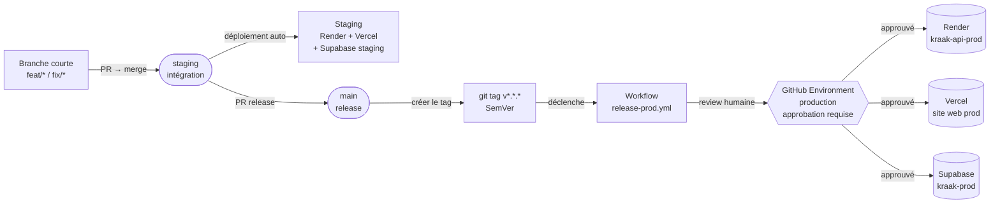

# ARC-07 — Stratégie de release production basée sur les tags

- Statut : Acceptée
- Date : 2026-05-02
- Portée : `.github/workflows/`, `render.yaml`, configuration Vercel,
  configuration Supabase, runbooks de release et d'environnement

## Contexte

Le MVP KRAAK approche d'un déploiement pilote en production. Jusqu'ici, seul un
environnement **staging** a été câblé (`apps/api/.env.staging`,
`supabase/.env.staging`, projet Render `kraak-api-staging`, projet Vercel en
preview). Aucune cible production n'existe et aucun garde-fou ne distingue
clairement « modifier le code » de « livrer en prod ».

Sans cadre, deux risques concrets émergent :

- une PR mergée sur `main` pourrait déclencher silencieusement un déploiement
  prod si l'on cible cet environnement avec un `autoDeploy` par défaut ;
- les secrets prod (Supabase prod, clés Resend prod) cohabiteraient avec ceux
  de staging, multipliant le risque de fuite ou de mauvais routage.

L'enjeu : poser des fondations simples mais strictes pour la prod **avant** de
provisionner le moindre service prod.

## Décision

KRAAK adopte une stratégie de release **prod uniquement sur tag SemVer**, avec
isolation totale des secrets et des projets de plateforme.

### Principes directeurs

1. **Push sur `main` ⇒ staging uniquement.** Aucun service prod ne suit `main`.
   > Précisé par [ARC-08](./ARC-08-staging-environment.md) : depuis le
   > 2026-05-03, le déclencheur staging est la branche longue `staging`,
   > avancée par fast-forward depuis `main`. `main` ne déploie plus
   > directement.
2. **Tag `v*.*.*` ⇒ prod.** Le seul déclencheur de prod est la création d'un
   tag SemVer (`v1.0.0`, `v1.1.0-rc.1`, etc.).
3. **Approbation humaine obligatoire.** Le déploiement prod passe par un
   GitHub Environment `production` avec required reviewers.
4. **Aucun secret prod en local ni dans le repo.** Les variables prod vivent
   uniquement dans GitHub Secrets, Render Env, Vercel Env.
5. **Rollback par re-deploy d'un tag antérieur.** Pas de `git push --force`,
   pas de `git tag -f`. Forward-fix (`v1.0.1`) ou rollback (`v0.9.x`).

### Périmètre couvert par cette décision

| Bloc               | Décision                                                                             |
| ------------------ | ------------------------------------------------------------------------------------ |
| GitHub Workflow    | Nouveau fichier `.github/workflows/release-prod.yml` sur `tags: ['v*']`              |
| GitHub Environment | `production` avec required reviewers + restriction « tags only »                     |
| Render (API)       | Service prod `kraak-api-prod` avec `autoDeploy: false` ; staging garde l'auto-deploy |
| Vercel (web)       | Production branch désactivée ; déploiement prod uniquement via API/CLI sur tag       |
| Supabase           | Projet **séparé** pour la prod (`kraak-prod`), distinct de `kraak-staging`           |
| Variables d'env    | `apps/api/.env.prod` reste **gitignoré** ; injection via Render/Vercel/GH Secrets    |
| Branch protection  | `main` protégée (review + status checks) ; tags `v*` créés depuis `main` uniquement  |
| Runbook            | `docs/runbooks/RELEASE_PROD.md` documente la procédure tag → review → deploy → smoke |

### Pipeline de release production

### Séparation des projets Supabase

Le projet Supabase actuel est rattaché à l'environnement **staging**. La prod
exige un projet **distinct** :

- isolation physique des données (RGPD, sauvegardes, audit) ;
- impossibilité d'écrire en prod par erreur depuis un script staging ;
- migrations validées d'abord en staging puis appliquées en prod via la même
  CLI mais avec un autre `SUPABASE_PROJECT_REF`.

La création du projet `kraak-prod` est une tâche distincte (non incluse dans
cette ADR), mais l'architecture cible est figée ici : **un projet Supabase par
environnement**, jamais de schéma partagé.

## Conséquences

Positives :

- Impossible de pousser en prod « par accident » via un merge sur `main`.
- Traçabilité complète : chaque déploiement prod = un tag SemVer + une
  approbation GitHub Environment + une exécution de workflow nommée.
- Rollback déterministe : re-déployer le tag précédent revient à un seul
  workflow run.
- Cloisonnement clair des secrets et des bases de données entre staging et
  prod.

Négatives / à surveiller :

- Le déploiement prod n'est plus instantané : il faut tagger, attendre la
  review GitHub Environment, attendre le workflow.
- Les hotfixes urgents passent par la même procédure (forward-fix avec un
  patch SemVer), ce qui demande de la discipline sur la qualité de `main`.
- Le projet Supabase prod a un coût additionnel (plan payant si dépassement du
  free tier).

## Conditions de levée / révision

Cette décision est révisable si :

1. Le volume de releases dépasse plusieurs déploiements prod par jour
   (introduction possible d'une branche `release/*` ou d'un canal canary).
2. KRAAK adopte un déploiement multi-région nécessitant plusieurs cibles prod
   coordonnées.
3. Une plateforme tierce remplace Render ou Vercel et impose un autre modèle
   de promotion.

## Liens

- Runbook : `docs/runbooks/RELEASE_PROD.md`
- Workflow : `.github/workflows/release-prod.yml`
- Configuration hébergeurs : `render.yaml`, configuration Vercel (UI)
- Variables d'environnement : `docs/runbooks/ENVIRONMENT_VARIABLES.md`
- Procédure d'urgence : `docs/runbooks/DEP-06_INCIDENT_ROLLBACK_PILOT_CHECKLIST_2026-04-30.md`
- Gate go/no-go : `docs/runbooks/DEP-07_GO_NO_GO_PILOT_RELEASE_2026-04-30.md`
