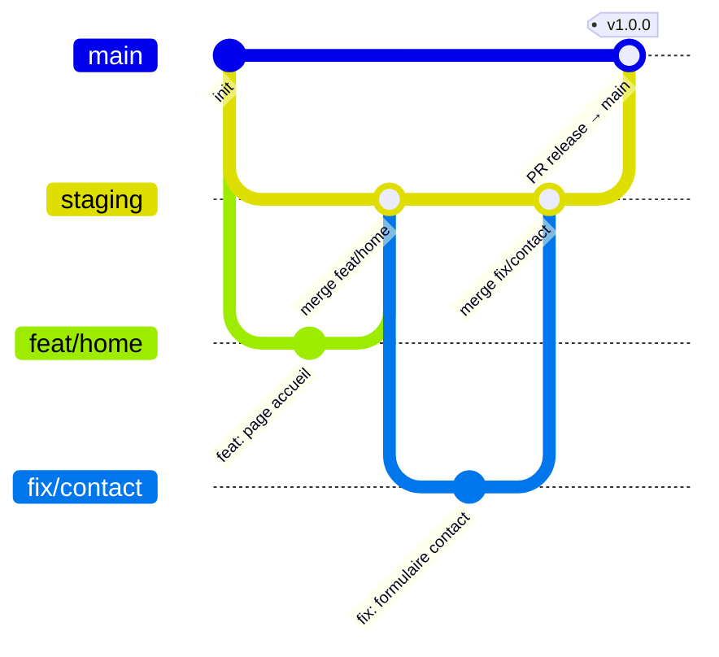

# ARC-09 — Inversion `main` ↔ `staging` : staging devient la branche d'intégration

| Champ           | Valeur                                                                               |
| --------------- | ------------------------------------------------------------------------------------ |
| **Statut**      | Acceptée                                                                             |
| **Date**        | 2026-05-03                                                                           |
| **Auteurs**     | Équipe KRAAK                                                                         |
| **Dépendances** | ARC-02 (workflow Git), ARC-07 (release prod par tag), ARC-08 (environnement staging) |
| **Liée à**      | `docs/runbooks/STAGING_PROMOTION.md`, `docs/runbooks/RELEASE_PROD.md`, `AGENTS.md`   |
| **Remplace**    | Sections « branchage » de ARC-02 et § 2.1/2.2 de ARC-08                              |

---

## 1 · Contexte

ARC-08 a posé `staging` comme branche **technique de déploiement**, alimentée
par fast-forward depuis `main`. ARC-07 a découplé la prod en faisant de
chaque tag SemVer le seul déclencheur de release.

À l'usage, ce modèle a deux faiblesses opérationnelles :

1. **`main` est devenue silencieusement « la branche de prod » sans en avoir
   les protections.** Un push direct (ou un merge mal validé) pouvait y
   atterrir alors que la prod attendait juste un tag, ce qui rendait `main`
   à la fois branche d'intégration ET point d'ancrage des tags — sans
   séparation claire des deux rôles.
2. **Le check requis `Render – kraak-consulting` (Production) n'est plus
   émis** depuis que les déploiements Render git-triggered ont été désactivés
   (ARC-07). Cela bloque mécaniquement tout merge sur `main` (`Missing
successful active Production – kraak-consulting deployment`), même quand
   tous les autres checks sont verts.

Plutôt que d'empiler des contournements (`--admin`, retrait ponctuel de
checks), KRAAK fige une organisation explicite.

---

## 2 · Décision

KRAAK **inverse les rôles** des deux branches longues posés par ARC-08 :

| Branche   | Rôle                                                                                                         |
| --------- | ------------------------------------------------------------------------------------------------------------ |
| `staging` | **Branche d'intégration longue.** Toutes les branches courtes en sont issues et y sont mergée par PR.        |
| `main`    | **Branche de release uniquement.** Avance par PR depuis `staging` ; sert d'ancrage aux tags SemVer (ARC-07). |

### 2.1 Règles de branchage (remplace ARC-02 § Workflow Git)

1. La branche par défaut du dépôt est `staging`.
2. Toute branche courte (`feat/*`, `fix/*`, `chore/*`, …) est créée depuis
   `staging` à jour et y revient par PR.
3. Aucune branche courte ne cible `main` directement.
4. `main` n'avance que par **PR depuis `staging`**, en rebase + fast-forward.
5. Aucun commit n'est créé directement sur `main` ni sur `staging`.
6. Les tags SemVer (`v*.*.*`) sont posés **sur `main`** uniquement, après
   merge de la PR de release. Le tag déclenche la prod (ARC-07).

### 2.2 Flux complet

```text
feat/* ──► PR ──► staging ──► déploiement staging (Render + Supabase)
                     │
                     ▼
            validation manuelle + E2E
                     │
                     ▼
            PR « release » ──► main ──► tag v*.*.* ──► prod (ARC-07)
```



### 2.3 Protections de branche (appliquées par script)

Le script `scripts/github/update-branch-protection.mjs` applique les règles
ci-dessous via `gh api`. Toute modification doit passer par ce script (et
non par l'UI GitHub) pour rester reproductible.

#### `staging` (intégration)

| Option                             |                  Valeur                   | Justification                                                          |
| ---------------------------------- | :---------------------------------------: | ---------------------------------------------------------------------- |
| `lock_branch`                      |                  `false`                  | Branche d'écriture via PR.                                             |
| `required_linear_history`          |                  `true`                   | Rebase only (cohérent avec ARC-02 résiduel).                           |
| `allow_force_pushes`               |                  `false`                  | Préserve l'historique partagé.                                         |
| `allow_deletions`                  |                  `false`                  | Branche permanente.                                                    |
| `required_conversation_resolution` |                  `true`                   | Pas de merge avec discussion ouverte.                                  |
| `required_pull_request_reviews`    |                 0 review                  | Solo dev ; 1 review obligatoire dès qu'un second mainteneur rejoint.   |
| `enforce_admins`                   |                  `false`                  | Permet un override admin documenté en cas d'incident.                  |
| `required_status_checks.strict`    |                  `true`                   | La PR doit être à jour avec `staging`.                                 |
| `required_status_checks.contexts`  | CI complète + `Render – kraak-consulting` | La staging Preview est obligatoire (cf. ARC-11, projet Render unique). |

#### `main` (release)

| Option                             |                      Valeur                      | Justification                                                         |
| ---------------------------------- | :----------------------------------------------: | --------------------------------------------------------------------- |
| `lock_branch`                      |                     `false`                      | Avance via PR de release depuis `staging`.                            |
| `required_linear_history`          |                      `true`                      | Historique de release lisible.                                        |
| `allow_force_pushes`               |                     `false`                      | Aucune réécriture sur `main`.                                         |
| `allow_deletions`                  |                     `false`                      | Branche permanente.                                                   |
| `required_conversation_resolution` |                      `true`                      | Pas de merge avec discussion ouverte.                                 |
| `required_pull_request_reviews`    |                     0 review                     | Cohérent avec `staging` ; à monter à 1 dès second mainteneur.         |
| `enforce_admins`                   |                     `false`                      | Permet un hot-fix tag de release contrôlé.                            |
| `required_status_checks.strict`    |                      `true`                      | La PR de release doit être à jour avec `main`.                        |
| `required_status_checks.contexts`  | CI complète **sans** `Render – kraak-consulting` | La prod n'est plus git-triggered (ARC-07) ; ce check n'est plus émis. |

### 2.4 Check supprimé sur `main`

Le contexte `Render – kraak-consulting` est **retiré** des
`required_status_checks` de `main`. Justification : depuis ARC-07, la prod
Render n'est plus déployée par push git mais par job manuel sur tag. Le
check n'est donc plus émis, et le maintenir bloquerait toute PR de release.

---

## 3 · Conséquences

### Positives

- Séparation nette « code en intégration » (`staging`) vs « code livré »
  (`main`).
- `main` redevient une branche **stable et rare** : un commit = une release.
- Le script de protection rend le modèle reproductible et auditable.
- Les PR ne sont plus bloquées par un check Render Production fantôme.

### Négatives / à surveiller

- Toutes les automatisations qui ciblaient `main` comme branche par défaut
  (CI, scripts d'agent, intégrations tierces) doivent être revues.
- La création des branches courtes doit explicitement partir de `staging` ;
  un `git checkout -b feat/x main` casserait la chaîne d'intégration.
- La PR de release `staging → main` doit être traitée comme un livrable
  (titre clair, changelog, vérification finale avant tag).

### Migration

1. Ré-pointer la branche par défaut GitHub sur `staging`
   (`Settings → General → Default branch`).
2. Mettre à jour les workflows CI dont les triggers ciblent `main` pour
   qu'ils ciblent `staging` (l'exécution sur `main` reste utile pour la
   release).
3. Mettre à jour les scripts d'agent (`AGENTS.md`) pour que les branches
   courtes partent de `staging`.
4. Documenter la procédure de release `staging → main → tag` dans le
   runbook `RELEASE_PROD.md`.

---

## 4 · Conditions de levée / révision

Cette décision est révisable si :

1. KRAAK introduit un environnement supplémentaire (`qa`, `demo`)
   nécessitant une matrice plus riche.
2. Le volume de releases dépasse plusieurs par jour et justifie de retirer
   l'étape PR `staging → main` au profit d'une promotion automatisée.
3. Un second mainteneur rejoint le projet : `required_approving_review_count`
   doit être passé à `1` sur les deux branches.

---

## 5 · Références

- [ARC-02 — Conventions dépôt et workflow Git](./ARC-02-conventions-repo.md)
  (sections « branchage » remplacées par cette ADR)
- [ARC-07 — Stratégie de release production basée sur les tags](./ARC-07-prod-release-tag-based.md)
- [ARC-08 — Environnement staging et branche longue `staging`](./ARC-08-staging-environment.md)
  (§ 2.1 et 2.2 remplacés par cette ADR)
- [`scripts/github/update-branch-protection.mjs`](../../scripts/github/update-branch-protection.mjs)
- [Runbook — Promotion staging](../runbooks/STAGING_PROMOTION.md)
- [Runbook — Release prod](../runbooks/RELEASE_PROD.md)
