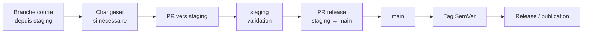

<!-- docs\runbooks\CHANGESETS.md -->

# CHANGESETS — Versionnage et release

## 1 · Objectif

Changesets sert à documenter les changements versionnés avant une release.

Dans ce dépôt, le workflow actif est aligné sur ARC-09 :

- les branches courtes partent de `staging` ;
- les PR de travail ciblent `staging` ;
- `main` ne reçoit que des PR de release depuis `staging` ;
- les tags SemVer sont posés sur `main` ;
- aucun flux `main` vers `staging` n'est utilisé.

## 2 · Flux global



## 3 · Quand créer un changeset

Créer un changeset quand le changement doit apparaître dans une release ou modifie une surface consommée :

- package partagé ;
- API publique ;
- contrat partagé ;
- comportement produit important ;
- changement de compatibilité ;
- changement visible pour les utilisateurs ou intégrateurs.

Ne pas créer de changeset pour :

- correction typographique mineure ;
- documentation historique ;
- commentaire interne sans effet ;
- refactor sans impact utilisateur ;
- modification de test sans changement fonctionnel.

## 4 · Créer un changeset

Depuis une branche courte créée depuis `staging`:

```bash
git switch staging
git pull --rebase origin staging
git switch -c feat/description-courte
pnpm changeset
```

Répondre aux questions de Changesets, puis committer le fichier généré dans `.changeset/`.

Exemple :

```bash
git add .changeset/*.md
git commit -m "docs(changeset): document feature release impact"
```

## 5 · PR de travail

La PR de travail cible `staging`.

```bash
git push -u origin HEAD
gh pr create --base staging --head "$(git branch --show-current)"
```

Avant de demander review ou merge :

```bash
pnpm format:check
pnpm test:workspace
```

Selon le changement :

```bash
pnpm test:libs
pnpm test:api
pnpm test:unit
pnpm build
```

## 6 · Validation sur staging

Après merge dans `staging`:

1. vérifier les checks GitHub ;
2. vérifier le déploiement staging ;
3. vérifier les logs ;
4. tester les parcours concernés ;
5. confirmer que le changeset correspond bien au changement livré.

Si une anomalie est détectée, créer une branche courte depuis `staging` et ouvrir une nouvelle PR vers `staging`.

## 7 · Release

Quand `staging` est validée :

```bash
gh pr create \
  --base main \
  --head staging \
  --title "release: promote staging to main"
```

Après merge de la PR de release :

```bash
git switch main
git pull --rebase origin main
git tag vX.Y.Z
git push origin vX.Y.Z
```

Le tag SemVer déclenche le workflow de production prévu par le runbook [`RELEASE_PROD`](../operations/RELEASE_PROD.md)

## 8 · Version PR

Si un workflow Changesets crée une PR de version, cette PR doit respecter le modèle actif :

- base: `staging` si elle prépare l'intégration;
- base: `main` uniquement si elle fait partie d'une release contrôlée;
- aucun mécanisme automatique ne doit synchroniser `main` vers `staging`.

Le mainteneur doit vérifier :

- les versions modifiées ;
- le changelog généré ;
- les packages impactés ;
- la cohérence avec le périmètre livré.

## 9 · Troubleshooting

### Aucun changeset n'a été ajouté

Si le changement est versionnable :

```bash
pnpm changeset
git add .changeset/*.md
git commit -m "docs(changeset): add release note"
git push
```

Si le changement ne nécessite pas de changeset, documenter la raison dans la PR.

### La PR de version est incorrecte

Corriger sur une branche courte depuis `staging`, puis ouvrir une PR vers `staging`.

```bash
git switch staging
git pull --rebase origin staging
git switch -c fix/version-notes
```

### Le tag SemVer n'a pas déclenché la release

Vérifier :

- que le tag a été créé sur `main`;
- que le tag respecte le format `vX.Y.Z`;
- que le workflow de release est actif ;
- que les permissions GitHub Actions permettent l'exécution attendue.

### Un changeset a été mergé sans release

C'est acceptable tant que la release n'est pas prête. Le changeset reste dans l'historique de `staging` et sera pris en compte lors de la prochaine release.

## 10 · Anti-patterns

Ne pas :

- créer un changeset directement sur `main` pour une fonctionnalité non validée ;
- ouvrir une PR de fonctionnalité vers `main` ;
- poser un tag SemVer sur `staging` ;
- synchroniser `main` vers `staging` ;
- supprimer un changeset sans justification ;
- mélanger plusieurs changements indépendants dans un seul changeset vague.

## 11 · Checklist PR

- [ ] Branche courte créée depuis `staging`
- [ ] Changeset créé si nécessaire
- [ ] PR ciblant `staging`
- [ ] Format et tests exécutés
- [ ] Changelog cohérent si généré
- [ ] Pas de tag créé avant merge de release sur `main`
