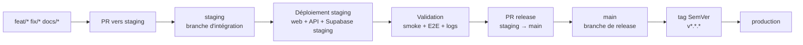

# Validation staging et préparation release

> Malgré son nom historique, ce document ne décrit plus une promotion depuis
> `main` vers `staging`.
>
> `staging` est la branche d'intégration longue. Elle reçoit les PR de travail
> et déclenche la validation staging.
>
> `main` est la branche de release. Elle avance uniquement par PR de release
> depuis `staging`.

Voir aussi :

- [`ARC-09-inversion-main-staging`](../decisions/ARC-09-inversion-main-staging.md)
- [`ARC-07-prod-release-tag-based`](../decisions/ARC-07-prod-release-tag-based.md)
- [`RELEASE_PROD`](RELEASE_PROD.md)
- [`ENVIRONMENTS`](ENVIRONMENTS.md)
- [`DEPLOYMENT`](DEPLOYMENT.md)
- [`STAGING_PROD_SEPARATION_30MIN`](../archive/deployment-transition/STAGING_PROD_SEPARATION_30MIN.md)

---

## 1 · Principe

Le flux actif est :



Règles :

- les branches courtes partent de `staging` ;
- les PR de travail ciblent `staging` ;
- `staging` sert à l'intégration et à la validation ;
- `main` ne reçoit que des PR de release depuis `staging` ;
- les tags SemVer sont posés sur `main` uniquement ;
- aucun flux de synchronisation retour depuis `main` vers `staging` n'est utilisé.

## 2 · Préconditions

Avant de valider staging :

- la PR de travail est mergée vers `staging` ;
- les checks GitHub requis sur `staging` sont verts ;
- les services staging sont disponibles ;
- les variables d'environnement staging sont renseignées côté plateforme ;
- aucune anomalie bloquante n'est ouverte sur le périmètre validé.

## 3 · Services staging

| Surface           | Service / cible                                  |
| ----------------- | ------------------------------------------------ |
| Web staging       | Render static site `kraak-web-staging`           |
| API staging       | Render Docker service `kraak-api-staging`        |
| Base/Auth/Storage | Projet Supabase staging                          |
| Email             | Resend avec variables staging côté plateforme    |
| Analytics         | Configuration staging ou désactivation contrôlée |

## 4 · Mise à jour locale

```bash
git switch staging
git pull --rebase origin staging
```

Vérifier le commit courant :

```bash
git log --oneline --decorate -10
```

## 5 · Vérification staging

### 5.1 · API

```bash
curl -i https://kraak-api-staging.onrender.com/health
```

Attendu:

- HTTP 200;
- payload de santé lisible;
- version cohérente si `APP_VERSION` est renseigné;
- aucune erreur critique dans les logs Render.

### 5.2 · Web

```bash
curl -i https://kraak-web-staging.onrender.com/health
```

Attendu:

- HTTP 200 ou redirection maîtrisée;
- pas de protection involontaire;
- routes publiques accessibles;
- routes protégées cohérentes avec `CLIENT_FEATURE_PARTICIPANT_AREA`.

### 5.3 · Supabase

```bash
pnpm supabase link --project-ref "$SUPABASE_STAGING_PROJECT_REF"
pnpm supabase db push
```

Règle stricte : les migrations staging doivent être appliquées avant de valider un comportement applicatif qui dépend du nouveau schéma.

## 6 · Smoke tests recommandés

Vérifier au minimum :

- page d'accueil;
- navigation principale;
- page services;
- page programmes;
- page contact;
- formulaire de contact selon les capacités de l'environnement;
- pages de support `401`, `403`, `404`, `500` si le changement les touche;
- comportement attendu de l'espace participant selon `CLIENT_FEATURE_PARTICIPANT_AREA`.

Exécuter les tests pertinents :

```bash
pnpm format:check
pnpm test:workspace
pnpm test:e2e:web
```

Selon le périmètre :

```bash
pnpm test:api
pnpm test:libs
pnpm build
```

## 7 · En cas d'échec

Ne pas corriger directement sur `staging`.

Créer une branche courte depuis `staging`:

```bash
git switch staging
git pull --rebase origin staging
git switch -c fix/description-courte
```

Corriger, tester, puis ouvrir une PR vers `staging`:

```bash
git push -u origin HEAD
gh pr create --base staging --head "$(git branch --show-current)"
```

## 8 · Préparer une release

Quand staging est validée :

```bash
gh pr create \
  --base main \
  --head staging \
  --title "release: promote staging to main"
```

La PR de release doit inclure :

- résumé du périmètre livré;
- lien vers les checks staging;
- lien vers les issues ou items GitHub Project;
- notes de migration si nécessaire;
- risques connus ou décision explicite de non-risque.

Après merge de la PR de release:

```bash
git switch main
git pull --rebase origin main
git tag vX.Y.Z
git push origin vX.Y.Z
```

La suite est couverte par le runbook [`RELEASE_PROD`](RELEASE_PROD.md).

## 9 · Rollback staging

### 9.1 · Correction applicative

Préférer un forward-fix :

```bash
git switch staging
git pull --rebase origin staging
git switch -c fix/staging-issue
```

Puis PR vers `staging`.

### 9.2 · Rollback exceptionnel

Un rollback de branche doit rester exceptionnel et documenté.

```bash
git switch staging
git fetch origin
git reset --hard <sha-stable>
git push --force-with-lease origin staging
```

Documenter :

- cause;
- commit cible;
- impact;
- personne responsable;
- lien vers l'issue ou l'incident.

### 9.3 · Migrations Supabase

Les migrations Supabase ne se rollbackent pas par défaut. Elles se compensent par une nouvelle migration corrective.

Si une migration staging casse le schéma :

1. créer une migration corrective sur une branche courte depuis `staging`;
2. ouvrir une PR vers `staging`;
3. appliquer la migration corrective sur le projet Supabase staging;
4. revalider l'API et les parcours concernés.

Ne jamais restaurer un dump staging par-dessus un schéma existant sans synchroniser l'historique des migrations versionnées.

## 10 · Anti-patterns interdits

Ne pas:

- créer une branche courte depuis `main`;
- ouvrir une PR de fonctionnalité vers `main`;
- synchroniser `staging` depuis `main`;
- créer un commit directement sur `staging`;
- créer un commit directement sur `main`;
- pousser en force sur `staging` hors rollback documenté;
- poser un tag de production sur `staging`;
- promouvoir vers prod sans validation staging documentée ;
- réutiliser le projet Supabase staging pour des données réelles de production.

## 11 · Tableau de synthèse

| Environnement | Branche / déclencheur | Web                        | API                 | Base             | Usage              |
| ------------- | --------------------- | -------------------------- | ------------------- | ---------------- | ------------------ |
| Local         | branche courte        | Angular dev server         | NestJS local        | Supabase local   | développement      |
| Staging       | push sur `staging`    | `kraak-web-staging` Render | `kraak-api-staging` | Supabase staging | intégration / QA   |
| Production    | tag SemVer sur `main` | cible prod contrôlée       | `kraak-api-prod`    | Supabase prod    | utilisateurs réels |

12 · Checklist rapide

À copier dans une PR ou un item Project :

- [ ] Branche courte issue de `staging`
- [ ] PR mergée dans `staging`
- [ ] Checks GitHub verts
- [ ] Migrations Supabase appliquées si nécessaire
- [ ] API staging `/health` vérifiée
- [ ] Web staging vérifié
- [ ] Smoke tests exécutés
- [ ] Logs Render vérifiés
- [ ] Issues / Project mis à jour
- [ ] PR de release `staging → main` prête si staging est validée
