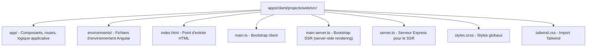

# Guide du mode développement

Ce guide explique comment lancer et utiliser chaque application du monorepo en développement.

---

## Prérequis

Avant de lancer quoi que ce soit :

1. **Node.js 24+** installé (`node -v` pour vérifier)
2. **pnpm 10+** activé (`pnpm -v` pour vérifier)
3. Dépendances installées : `pnpm install` à la racine
4. Fichiers `.env` configurés (voir ci-dessous)

### Configurer les variables d'environnement

```bash
# Backend
cp apps/api/.env.example apps/api/.env

# Client (optionnel, utile pour Playwright / scripts)
cp apps/client/.env.example apps/client/.env
```

Voir [`ENVIRONMENT_VARIABLES.md`](ENVIRONMENT_VARIABLES.md) pour la référence complète.
La configuration Auth locale versionnée pour le MVP est décrite dans
[`SUPABASE_AUTH_SETUP.md`](SUPABASE_AUTH_SETUP.md).

**Variables minimales pour développer en local :**

| Variable              | Fichier         | Exemple                        |
| --------------------- | --------------- | ------------------------------ |
| `SUPABASE_URL`        | `apps/api/.env` | `http://127.0.0.1:54321`       |
| `SUPABASE_SECRET_KEY` | `apps/api/.env` | clé fournie par Supabase local |

### Profil DB local prêt à l'emploi (Supabase + Docker Compose)

Ce profil garde Supabase hors de Docker Compose (via Supabase CLI) et utilise
`compose.local.yml` uniquement pour le front et l'API.

Prérequis :

1. Docker Desktop démarré
2. Supabase CLI installée et accessible (`supabase --version`)

Étapes :

1. Démarrer Supabase local depuis la racine du dépôt :

```bash
supabase start
```

1. Récupérer les valeurs locales (URL + clés) :

```bash
supabase status
```

1. Exporter les variables puis démarrer Compose.

Exemple Bash :

```bash
export SUPABASE_URL="http://host.docker.internal:54321"
export SUPABASE_SECRET_KEY="<service_role_key_depuis_supabase_status>"
export SUPABASE_PUBLISHABLE_KEY="<anon_key_depuis_supabase_status>"
export CLIENT_SUPABASE_URL="$SUPABASE_URL"
export CLIENT_SUPABASE_PUBLISHABLE_KEY="$SUPABASE_PUBLISHABLE_KEY"
export CLIENT_API_BASE_URL="http://api:3000"
docker compose -f compose.local.yml up --build
```

Exemple PowerShell :

```powershell
$env:SUPABASE_URL = "http://host.docker.internal:54321"
$env:SUPABASE_SECRET_KEY = "<service_role_key_depuis_supabase_status>"
$env:SUPABASE_PUBLISHABLE_KEY = "<anon_key_depuis_supabase_status>"
$env:CLIENT_SUPABASE_URL = $env:SUPABASE_URL
$env:CLIENT_SUPABASE_PUBLISHABLE_KEY = $env:SUPABASE_PUBLISHABLE_KEY
$env:CLIENT_API_BASE_URL = "http://api:3000"
docker compose -f compose.local.yml up --build
```

1. Arrêter les services applicatifs puis la DB locale :

```bash
docker compose -f compose.local.yml down
supabase stop
```

Notes importantes :

- Dans un conteneur Docker, `localhost` pointe vers le conteneur lui-même.
  `host.docker.internal` est donc requis pour joindre Supabase local lancé sur
  la machine hôte.
- Le front est servi en statique par Compose et lit les valeurs runtime via
  `runtime-config.js` généré au build.

Option automatisée (recommandée) :

- Bash : `./scripts/compose-up-with-supabase-local.sh`
- PowerShell : `./scripts/compose-up-with-supabase-local.ps1`

Ces scripts lancent `supabase start`, récupèrent les clés via
`supabase status -o env`, exportent les variables nécessaires puis exécutent
`docker compose -f compose.local.yml up --build`.

---

## Lancer le site web (Angular SSR)

```bash
pnpm dev:web
```

- URL : **<http://localhost:4200>**
- Hot-reload : oui (les modifications dans `apps/client/projects/web/` se reflètent automatiquement)
- Commande sous-jacente : `ng serve web --configuration local`
- Option utile pour les tests/outils en PowerShell :
  `$env:KRAAK_WEB_PORT='4201'; pnpm.cmd --filter @kraak/client exec playwright test`

### Structure du code web



---

## Lancer l'API (NestJS)

```bash
pnpm dev:api
```

- URL : **<http://localhost:3000>**
- Hot-reload : oui (`cross-env NODE_ENV=local nest start --watch`)
- Tester que ça tourne : `curl http://localhost:3000` (devrait retourner une réponse)

### Structure du code API

```mermaid
flowchart TD
    apisrc["apps/api/src/"]
    apisrc --> apimain["main.ts - Point d'entrée, bootstrap NestJS"]
    apisrc --> apimodule["app.module.ts - Module racine actuel"]
    apisrc --> apicontroller["app.controller.ts - Route health (GET /health)"]
    apisrc --> apiservice["app.service.ts - Service principal"]
    apisrc --> apiannouncements["announcements/ - Répertoire métier scaffoldé"]
    apisrc --> apiauth["auth/ - Répertoire métier scaffoldé"]
    apisrc --> apidashboard["dashboard/ - Répertoire métier scaffoldé"]
    apisrc --> apiprograms["programs/ - Répertoire métier scaffoldé"]
    apisrc --> apiresources["resources/ - Répertoire métier scaffoldé"]
    apisrc --> apisupport["support/ - Répertoire métier scaffoldé"]
```



> À ce stade, `AppModule` reste minimal et les répertoires métier servent encore
> surtout de structure cible.

---

## Lancer l'app mobile (Ionic + Capacitor)

```bash
pnpm dev:mobile
```

- URL : **<http://localhost:4300>**
- Hot-reload : oui
- Commande sous-jacente : `ng serve mobile --configuration local --port 4300`
  via la commande racine `pnpm dev:mobile`

> **Note :** Pour tester sur un appareil physique ou un émulateur, il faut configurer Capacitor séparément. Ce mode lance uniquement l'aperçu web.

---

## Lancer plusieurs apps en même temps

Les trois apps peuvent tourner en parallèle avec une seule commande :

```bash
pnpm dev
```

- Web : **<http://localhost:4200>** par défaut, ou le prochain port libre
- Mobile : **<http://localhost:4300>** par défaut, ou le prochain port libre
- API : **<http://localhost:3000>**

Le script `pnpm dev` sonde les ports web et mobile avant démarrage pour éviter
une première tentative en échec quand `4200` ou `4300` sont déjà utilisés.

Pour les outils qui doivent cibler explicitement le serveur web local
(notamment Playwright), la variable `KRAAK_WEB_PORT` permet d'aligner l'URL de
base sur le port réellement utilisé.

Si le site web local consomme l'API et tourne sur un port différent de `4200`,
penser aussi à aligner `CORS_ALLOWED_ORIGINS` côté API locale.

Si vous avez besoin de lancer une seule app, les commandes `pnpm dev:web`, `pnpm dev:mobile` et `pnpm dev:api` restent disponibles.

Pour la recette / préproduction, les scripts dédiés sont :

```bash
pnpm dev:api:staging
pnpm dev:web:staging
pnpm dev:mobile:staging
```

> Si le port `3000` est déjà occupé, `pnpm dev` ne relance pas l'API sur un autre port, car le front local continue d'attendre l'API sur `http://localhost:3000`.

---

## Commandes de test

```bash
# Tous les tests
pnpm test

# Vérifier uniquement le runner de test racine
pnpm test:workspace

# Tests unitaires API (Jest)
pnpm test:api

# Tests unitaires client en une exécution (via `ng test --watch=false`)
pnpm test:unit

# Tests unitaires client en watch
pnpm --filter @kraak/client test:watch

# Tests E2E web (Playwright dans apps/client/tests/e2e)
pnpm test:e2e
```

Le runner racine exécute les phases dans cet ordre : bibliothèques partagées,
tests API + client, puis E2E web.

`pnpm test:workspace` inclut aussi une vérification rapide de la configuration
Auth Supabase versionnée pour éviter les régressions sur les redirections, les
templates email et le bootstrap `auth.users` -> `public.app_user`.

---

## Commandes de build

```bash
# Tous les builds
pnpm build

# Builds ciblés
pnpm build:web
pnpm build:mobile
pnpm build:api
```

---

## Commandes de qualité

```bash
# Vérifier le formatage
pnpm format:check

# Formater automatiquement
pnpm format

# Lancer le linter
pnpm lint

# Linter uniquement l'API
pnpm lint:api
```

---

## Dépannage courant

### `pnpm install` échoue

- Vérifier la version de Node : `node -v` (doit être ≥ 24.14)
- Vérifier la version de pnpm : `pnpm -v` (doit être ≥ 10)
- Supprimer le cache et réessayer : `rm -rf node_modules && pnpm install`

### Le port 4200 ou 3000 est déjà utilisé

- Fermer l'autre processus qui utilise le port
- Ou changer le port : `ng serve web --port 4201`
- Ou lancer `pnpm dev` pour laisser le script choisir automatiquement le
  prochain port libre côté web/mobile

### Les hooks Git bloquent mon commit

- Formatage : `pnpm format` puis réessayer
- Lint : corriger les erreurs ESLint
- Message de commit : relancer `pnpm commit`
- Voir [`CONTRIBUTING.md`](../../CONTRIBUTING.md) pour les détails

### Les variables d'environnement ne sont pas reconnues

- Vérifier que `apps/api/.env` et `apps/client/.env` existent bien
- Redémarrer le serveur de développement après avoir modifié un fichier `.env`

### Vite échoue avec `EPERM ... .angular/cache ... deps_temp`

- Ce cas apparaît parfois sous Windows quand Vite réoptimise les dépendances
  après un changement de lockfile
- `pnpm dev` tente maintenant de nettoyer le cache Angular/Vite du projet
  concerné puis de relancer automatiquement le service
- Si le verrou persiste, arrêter les serveurs, supprimer `apps/client/.angular/cache/`,
  puis relancer `pnpm dev`
