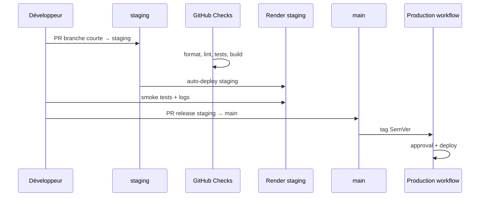

<!-- docs\runbooks\GIT_WORKFLOW_COMPLETE.md -->

# GIT_WORKFLOW_COMPLETE — Workflow Git complet

> Référence active : `staging` est la branche d'intégration ; `main` est la
> branche de release.
>
> Les branches courtes partent de `staging` et ouvrent leurs PR vers `staging`.
> `main` ne reçoit que des PR de release `staging → main`.

Voir aussi :

- [`GIT_WORKFLOW_CHEATSHEET.md`](GIT_WORKFLOW_CHEATSHEET.md)
- [`STAGING_PROMOTION.md`](STAGING_PROMOTION.md)
- [`RELEASE_PROD.md`](RELEASE_PROD.md)
- [`CHANGESETS.md`](CHANGESETS.md)
- [`ARC-09-inversion-main-staging`](../decisions/ARC-09-inversion-main-staging.md)

---

## 1 · Vue d'ensemble

```mermaid
flowchart LR
    start["staging à jour"]
    branch["branche courte<br/>feat/* fix/* docs/*"]
    work["implémentation<br/>petit incrément"]
    checks["tests locaux"]
    pr["PR vers staging"]
    ci["checks GitHub"]
    merge["merge vers staging"]
    deploy["déploiement staging"]
    validation["validation staging"]
    releasePr["PR release<br/>staging → main"]
    tag["tag SemVer sur main"]
    prod["workflow production"]

    start --> branch --> work --> checks --> pr --> ci --> merge --> deploy --> validation --> releasePr --> tag --> prod
```



Règles principales :

- `staging` est la branche par défaut et d'intégration ;
- `main` est la branche de release ;
- aucun commit direct sur `staging` ou `main` ;
- aucune PR de travail vers `main` ;
- aucun tag SemVer sur `staging`.

## 2 · Préparer son environnement

Vérifier le dépôt :

```bash
git remote -v
git branch -a
git status --short
```

Le remote attendu est :

```txt
origin  https://github.com/Ange230700/kraak-consulting.git
```

La branche de travail de départ doit être `staging`.

## 3 · Démarrer une tâche

Mettre `staging` à jour:

```bash
git switch staging
git pull --rebase origin staging
```

Créer une branche courte :

```bash
git switch -c feat/description-courte
```

Types de branches autorisés :

| Type         | Usage                           |
| ------------ | ------------------------------- |
| `feat/*`     | fonctionnalité                  |
| `fix/*`      | correction                      |
| `docs/*`     | documentation                   |
| `chore/*`    | maintenance                     |
| `test/*`     | tests                           |
| `refactor/*` | refactor sans changement métier |
| `ci/*`       | CI/CD                           |
| `build/*`    | build / packaging               |
| `style/*`    | formatage ou style sans logique |
| `perf/*`     | performance                     |
| `revert/*`   | revert                          |

## 4 · Développer

Travailler par petits incréments.

Avant commit :

```bash
git status --short
pnpm format:check
pnpm test:workspace
```

Selon la portée :

```bash
pnpm typecheck
pnpm test:libs
pnpm test:api
pnpm test:unit
pnpm test:e2e:web
pnpm build
```

## 5 · Commits

Utiliser Conventional Commits avec scope.

Format :

```txt
<type>(<scope>): <description>
```

Exemples :

```bash
git commit -m "docs(workflow): align staging branch instructions"
git commit -m "fix(api): map invite rate limit to 429"
git commit -m "feat(web): enable participant navigation flow"
```

Scopes usuels :

| Scope        | Usage              |
| ------------ | ------------------ |
| `root`       | racine repo        |
| `repo`       | conventions dépôt  |
| `docs`       | documentation      |
| `scripts`    | scripts            |
| `web`        | application web    |
| `mobile`     | application mobile |
| `api`        | API NestJS         |
| `client`     | workspace Angular  |
| `contracts`  | contrats partagés  |
| `domain`     | logique métier     |
| `api-client` | client API partagé |
| `tokens`     | design tokens      |
| `infra`      | infra              |
| `ci`         | CI/CD              |

## 6 · Rebaser avant push

Avant de pousser :

```bash
git fetch origin
git rebase origin/staging
```

En cas de conflit :

```bash
git status
# résoudre les fichiers
git add <fichiers>
git rebase --continue
```

Si le rebase doit être annulé :

```bash
git rebase --abort
```

## 7 · Pousser la branche

```bash
git push -u origin HEAD
```

Si la branche a déjà été poussée et a été rebasée :

```bash
git push --force-with-lease
```

Ne jamais utiliser git push --force sans --force-with-lease.

## 8 · Ouvrir une PR vers staging

```bash
gh pr create \
  --base staging \
  --head "$(git branch --show-current)"
```

La PR doit contenir :

- résumé du changement ;
- issue liée si applicable ;
- commandes de validation exécutées ;
- captures ou preuves si l'UI change ;
- note sur les migrations si applicable ;
- note sur les variables d'environnement si applicable.

## 9 · Checks requis

Les checks exacts peuvent évoluer dans GitHub, mais la PR doit au minimum respecter :

- format ;
- lint ;
- tests unitaires ;
- build ;
- E2E si le périmètre l'exige ;
- checks spécifiques aux packages ou à l'infra.

Pour vérifier localement :

```bash
pnpm format:check
pnpm typecheck
pnpm test:workspace
pnpm build
```

## 10 · Merge vers staging

Après validation :

1. vérifier que la PR cible `staging` ;
2. vérifier que la branche est à jour ;
3. merger sans merge commit ;
4. supprimer la branche distante ;
5. mettre à jour l'issue et le Project GitHub.

Après merge :

```bash
git switch staging
git pull --rebase origin staging
git branch -d <branche-courte>
git push origin --delete <branche-courte>
```

## 11 · Déploiement staging

Un push sur `staging` déclenche les services staging configurés.

Surfaces principales :

| Surface | Cible                                     |
| ------- | ----------------------------------------- |
| Web     | Render static site `kraak-web-staging`    |
| API     | Render Docker service `kraak-api-staging` |
| Base    | Supabase staging                          |

Vérifier :

```bash
curl -I https://kraak-web-staging.onrender.com
curl -i https://kraak-api-staging.onrender.com/health
```

Voir aussi [`STAGING_PROMOTION.md`](STAGING_PROMOTION.md).

## 12 · Corrections après validation staging

Si une anomalie est détectée sur staging :

```bash
git switch staging
git pull --rebase origin staging
git switch -c fix/description-courte
```

Corriger, tester, puis ouvrir une PR vers `staging`.

Ne pas corriger directement sur `staging`.

## 13 · Release vers main

Quand `staging` est validée :

```bash
gh pr create \
  --base main \
  --head staging \
  --title "release: promote staging to main"
```

La PR de release doit inclure :

- résumé des changements ;
- validation staging ;
- migrations appliquées ;
- risques connus ;
- lien vers les issues ou milestone ;
- décision go/no-go si applicable.

`main` ne doit pas recevoir de PR de fonctionnalité.

## 14 · Tag SemVer

Après merge de la PR de release :

```bash
git switch main
git pull --rebase origin main
git tag vX.Y.Z
git push origin vX.Y.Z
```

Le tag SemVer déclenche le workflow de production.

Voir [`RELEASE_PROD.md`](RELEASE_PROD.md).

## 15 · Hotfix

Un hotfix production suit le même principe de traçabilité.

Chemin recommandé :

1. créer une branche courte depuis `staging` ;
2. corriger ;
3. PR vers staging ;
4. valider staging ;
5. PR release `staging → main` ;
6. tag patch SemVer sur `main`.

Si une urgence impose un chemin plus court, documenter explicitement :

- raison ;
- impact ;
- validation minimale ;
- rollback ;
- issue associée.

## 16 · Migrations Supabase

Si un changement contient des migrations :

1. vérifier les migrations localement ;
2. appliquer en staging avant validation fonctionnelle ;
3. documenter l'application dans la PR ;
4. appliquer en production uniquement dans le flux de release.

Commandes usuelles :

```bash
pnpm supabase link --project-ref "$SUPABASE_STAGING_PROJECT_REF"
pnpm supabase db push
```

Ne jamais modifier le schéma de production hors procédure de release.

## 17 · Changesets

Si le changement doit être versionné :

```bash
pnpm changeset
```

La PR de travail reste une PR vers `staging`.

Voir [`CHANGESETS.md`](./CHANGESETS.md).

## 18 · Nettoyage de branche

Après merge :

```bash
git switch staging
git pull --rebase origin staging
git branch --merged
git branch -d <branche>
git push origin --delete <branche>
```

Ne pas supprimer :

- `staging` ;
- `main` ;
- branches liées à une PR ouverte.

## 19 · Récupération locale

### Annuler des changements non commités

```bash
git restore <fichier>
```

### Annuler tous les changements non commités

```bash
git restore .
```

### Désindexer sans perdre les changements

```bash
git restore --staged .
```

### Réaligner une branche courte sur staging

Attention : cette commande supprime les commits locaux non poussés.

```bash
git fetch origin
git reset --hard origin/staging
```

## 20 · Anti-patterns

Ne pas :

- créer une branche courte depuis `main` ;
- ouvrir une PR de fonctionnalité vers `main` ;
- merger une branche courte directement dans `main` ;
- créer un commit direct sur `staging` ;
- créer un commit direct sur `main` ;
- synchroniser `staging` depuis `main` ;
- poser un tag SemVer sur `staging` ;
- utiliser `--no-verify` ;
- utiliser `git push --force` au lieu de `--force-with-lease` ;
- ignorer une migration Supabase liée à un changement applicatif.

## 21 · Résumé opérationnel

| Étape      | Branche / cible               | Commande clé                               | Résultat               |
| ---------- | ----------------------------- | ------------------------------------------ | ---------------------- |
| Départ     | `staging`                     | `git pull --rebase origin staging`         | base à jour            |
| Travail    | `feat/*` / `fix/*` / `docs/*` | `git switch -c ...`                        | branche courte         |
| Validation | branche courte                | `pnpm format:check && pnpm test:workspace` | feedback local         |
| PR         | `staging`                     | `gh pr create --base staging`              | intégration            |
| Staging    | `staging`                     | auto-deploy                                | validation pré-release |
| Release PR | `main`                        | `gh pr create --base main --head staging`  | préparation prod       |
| Tag        | `main`                        | `git tag vX.Y.Z`                           | déclenchement prod     |

## 22 · Diagramme détaillé



## 23 · Validation documentaire

Avant commit, vérifier manuellement que les documents actifs ne contiennent plus :

- une synchronisation inverse vers `staging` ;
- un rebase de branche courte sur `main` ;
- une PR de travail vers `main` ;
- une promotion automatique depuis la branche de release ;
- une instruction de tag SemVer hors de `main`.
